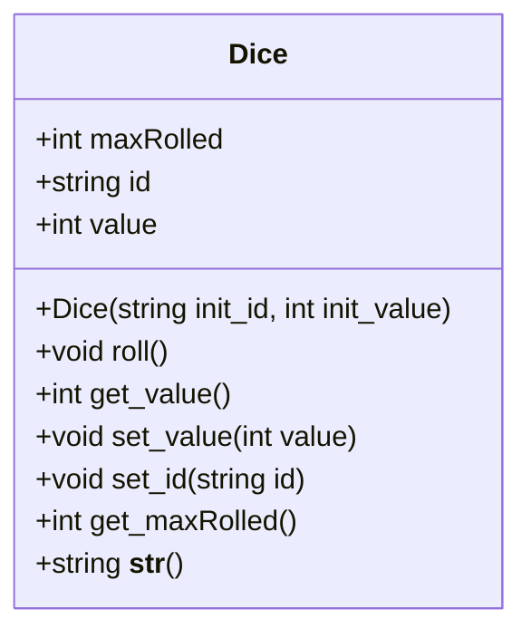

# Dice Class

```mermaid
classDiagram
    class Dice {
        +int maxRolled
        +string id
        +int value
        +Dice(string init_id, int init_value)
        +void roll()
        +int get_value()
        +void set_value(int value)
        +void set_id(string id)
        +int get_maxRolled()
        +string __str__()
    }
```
